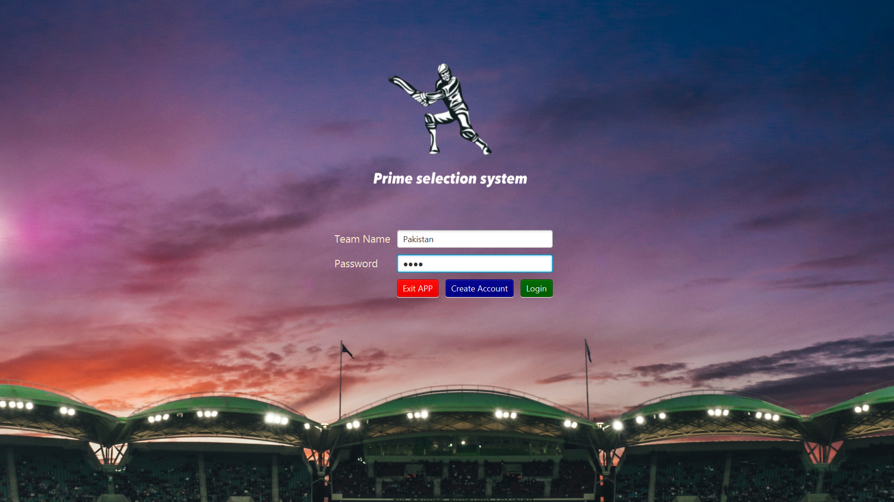
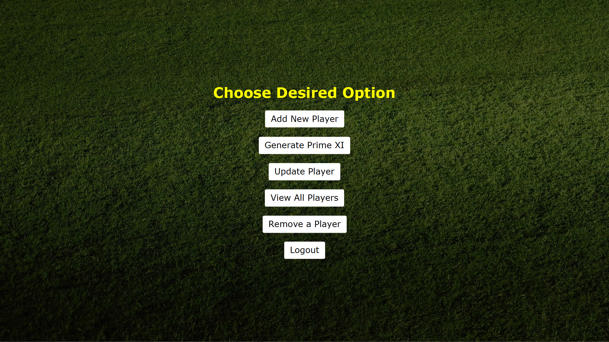
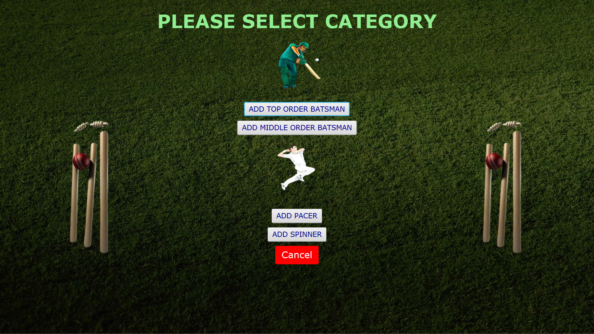
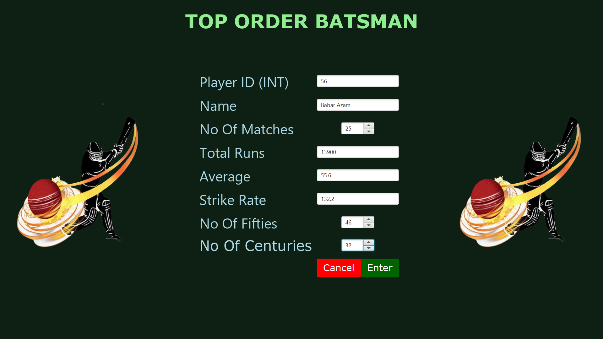
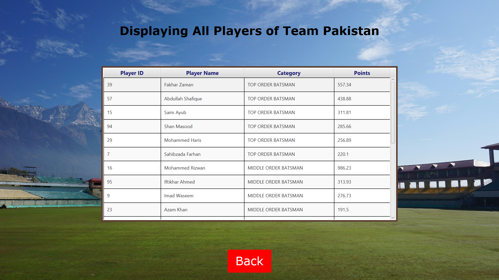
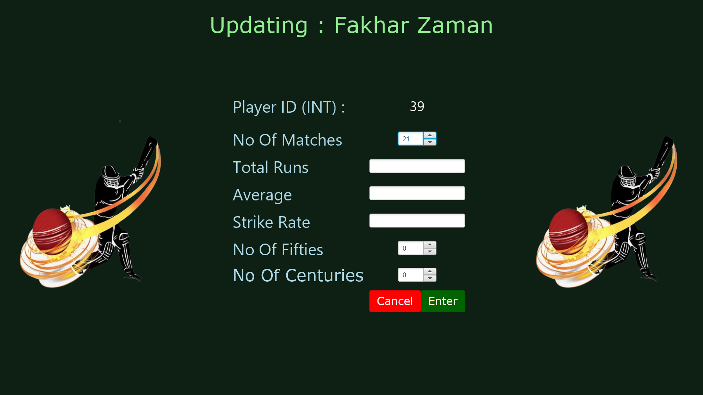

# 🏏 Cricket Team Generator

A desktop JavaFX application that helps users build the best possible cricket playing XI based on player roles and performance statistics. Built as an academic project to apply Java fundamentals, OOP, file handling, and basic GUI design.

---

## 🔧 Features

- 🔐 Login screen with simple authentication
- 🏠 Main menu to access all core features
- ⚙️ Select player type (Batsman, Bowler, All-Rounder)
- 📝 Add new player with stats (matches, economy, wickets, etc.)
- ✏️ Update player data
- 📋 View all stored players
- 🔢 Choose team size for generation
- 🧠 Generate optimal team based on stats

---

## 💻 Built With

- Java  
- JavaFX  
- File Handling (Text/CSV)  
- IntelliJ IDEA (Recommended IDE)

---

## 📸 Screenshots

### 🔐 Login Screen  

### 🏠 Main Menu  

### ⚙️ Select Player Type  

### 📝 Add Player Details  

### 📋 View All Players  

### 🔢 Select Team Requirements

### 🧠 Generated Team  

### ✏️ Update Player  

---

## 👤 Author

**Muhammad Danish Jawad**  
BS Software Engineering – COMSATS University, Lahore  
📧 [m.danishjawad@gmail.com](mailto:m.danishjawad@gmail.com)

---

## 📌 Note

This project was developed for academic purposes and to strengthen Java development skills.

